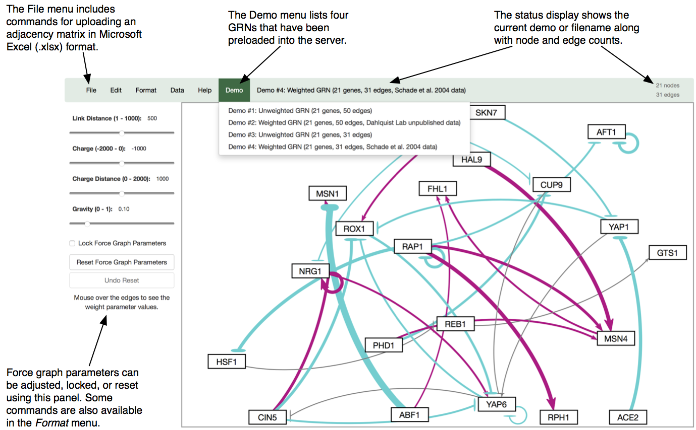

**CMSI 370** Interaction Design, Fall 2017

# Usability Study Report Template

Use the content of this file as a starting point for your usability study report. Copy-paste this into a new file called _report.md_ and edit as needed.

# Usability Study of Puzzle Games

- Simon Wroblewski
- Natasha Romanov
- Vic Stone
- Ryan Choi
- Luke Cage

## Study Description

- State the systems that were tested
- State the tasks that were chosen:

### Task 1: Do This
Provide a brief description of each task. It doesn’t have to be long—just enough for a reader who did not conduct the study (e.g., me) to understand what you asked the users to do. Include screenshots if needed.

### Task 2: Do That

### Task 3: Do Those

## Study Results
Provide the data that were gathered from the study. Tables and graphs (as images) are recommended. Refrain from adding commentary or conclusions in this section, except for indications of what the data _directly_ indicate, such as which system performed better for which metric.

Raw files such as spreadsheets or notes may be added to this repository, if you wish.

## Heuristic Evaluation
Consult the [assignment writeup](README.md) for details on this section. Put all of that here.

Here is a sample screenshot, because you will likely find it extremely useful to include them:

Feel free to add subsections to keep your analysis organized. Because different groups will have different choices for what to discuss, I can’t specify further specifics here. However, all groups _should_ have:

### Prioritization of Metrics
State the relative importance of each metric with respect to the tested systems. This prioritization is particularly useful for resolving “toss-ups” (i.e., situations where system A performs better at one metric but system B performs better at another). Needless to say, don’t prioritize at random; the chosen priorities should make sense for the systems that were tested.

### Usability Decision
Yes, take a stand. Make an explicit, informed decision on which system is more usable based on your testing and data. Explain your decision using a combination of the test results and your heuristic evaluation of the systems.

## Statement of Work
Again, see the [assignment writeup](README.md) for details. Your repository’s commit log will also inform our view of how well the study’s work was distributed across the team. To wit, one concrete thing _not_ to do is to designate a single group member as the “committer” or “typist” for the group. Everyone should be answerable for their contributions to the usability study, and part of this answerability is reflected in the act of _committing your own data and writing_ under your own GitHub username.

